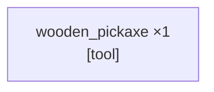

_PTD not yet generated._

---

# SCSG
_Updated: 2026-04-12T18:08:01.246Z_

**All sinks satisfied (r=2) — task complete.**


---

# Candidates — TEST
_Updated: 2026-04-12T18:07:50.729Z · 1 source node(s)_



---

<table width="100%"><tr>
<td width="50%" valign="top">

## Current Task
_Updated: 2026-04-12T18:07:52.879Z_

```json
{
  "target_item": "wooden_pickaxe",
  "qty": 1,
  "action_type": "craft",
  "parameters": {
    "crafting_inputs": [
      {
        "item": "any_plank",
        "qty": 3
      },
      {
        "item": "stick",
        "qty": 2
      }
    ],
    "workstation": "crafting_table"
  }
}
```

</td>
<td width="50%" valign="top">

## Current Action _(attempt 1)_
_Updated: 2026-04-12T18:07:53.709Z_

```
!craftRecipe("wooden_pickaxe", 1)
```

**Previous:**

- _(attempt 1)_ `!craftRecipe("crafting_table", 1)`
- _(attempt 1)_ `!craftRecipe("stick", 1)`
- _(attempt 1)_ `!craftRecipe("spruce_planks", 4)`
- _(attempt 1)_ `!collectBlocks("spruce_log", 3)`

</td>
</tr></table>