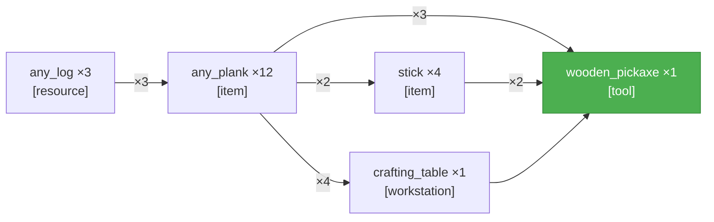
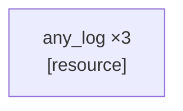

_PTD not yet generated._

---

# SCSG — www
_Updated: 2026-04-12T14:10:00.677Z · r=1_



---

# Candidates — www
_Updated: 2026-04-12T14:10:00.679Z · 1 source node(s)_



---

<table width="100%"><tr>
<td width="50%" valign="top">

## Current Task
_Updated: 2026-04-12T14:10:13.912Z_

```json
{
  "target_item": "any_log",
  "qty": 3,
  "action_type": "collect",
  "parameters": {
    "source_block": "oak_log",
    "item_dependency": null,
    "tool": null
  }
}
```

</td>
<td width="50%" valign="top">

## Current Action _(attempt 4)_
_Updated: 2026-04-12T14:10:16.884Z_

```
!searchForBlock("oak_log", 128)
```

</td>
</tr></table>