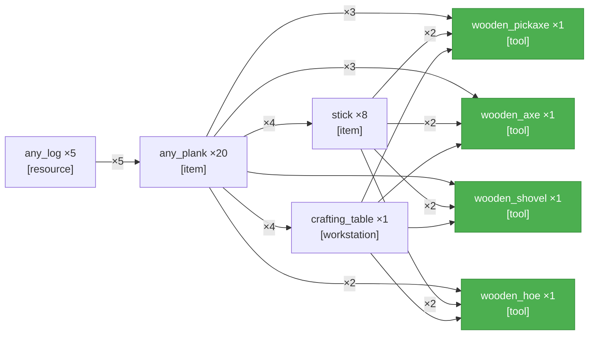

# PTD — Craft one type of every tool
_Updated: 2026-04-11T03:35:46.396Z_

---

_SCSG not yet generated._

---

<table width="100%"><tr>
<td width="50%" valign="top">

## Current Task
_NTS not yet run._

</td>
<td width="50%" valign="top">

## Current Action
_AM not yet run._

</td>
</tr></table>