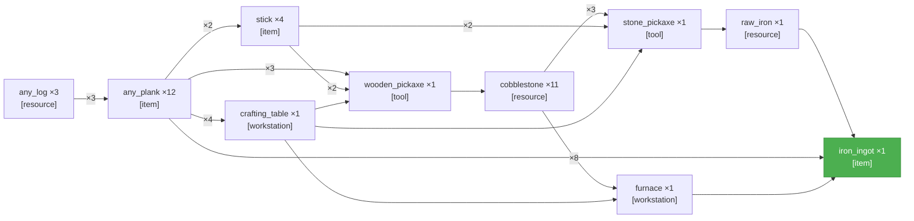

# PTD — Smelt an iron ingot.
_Updated: 2026-04-12T01:29:37.053Z_

---

# SCSG
_Updated: 2026-04-12T01:29:37.055Z_

**All sinks satisfied (r=2) — task complete.**

---

<table width="100%"><tr>
<td width="50%" valign="top">

## Current Task
_NTS not yet run._

</td>
<td width="50%" valign="top">

## Current Action
_AM not yet run._

</td>
</tr></table>