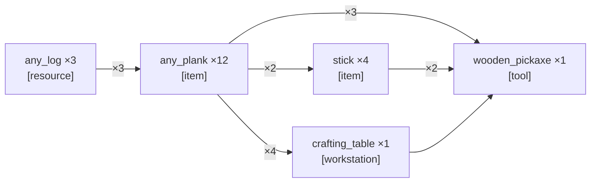

_PTD not yet generated._

---

# SCSG — Make an iron pickaxe
_Updated: 2026-04-12T04:44:50.998Z · r=1_



---

<table width="100%"><tr>
<td width="50%" valign="top">

## Current Task
_Updated: 2026-04-12T04:44:49.912Z_

```json
{
  "action_type": "search",
  "parameters": {
    "targets": [
      {
        "target": "any_log",
        "match_mode": "abstract_class"
      }
    ]
  },
  "rationale": "Search, because no source node is directly achievable: inventory is empty and nearby blocks show no logs, so locate any_log first."
}
```

</td>
<td width="50%" valign="top">

## Current Action _(attempt 2)_
_Updated: 2026-04-12T04:44:49.983Z_

```
!searchForBlock("spruce_log", 32)
```

</td>
</tr></table>