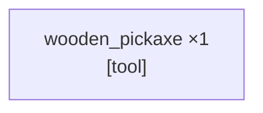

_PTD not yet generated._

---

# SCSG
_Updated: 2026-04-12T06:41:14.082Z_

**All sinks satisfied (r=2) — task complete.**


---

# Candidates — do something
_Updated: 2026-04-12T06:40:49.286Z · 1 source node(s)_



---

<table width="100%"><tr>
<td width="50%" valign="top">

## Current Task
_Updated: 2026-04-12T06:40:56.881Z_

```json
{
  "target_item": "wooden_pickaxe",
  "qty": 1,
  "action_type": "craft",
  "parameters": {
    "crafting_inputs": [
      {
        "item": "any_plank",
        "qty": 3
      },
      {
        "item": "stick",
        "qty": 2
      }
    ],
    "workstation": "crafting_table"
  }
}
```

</td>
<td width="50%" valign="top">

## Current Action _(attempt 2)_
_Updated: 2026-04-12T06:41:14.080Z_

```json
{
  "status": "TASK_COMPLETE"
}
```

</td>
</tr></table>