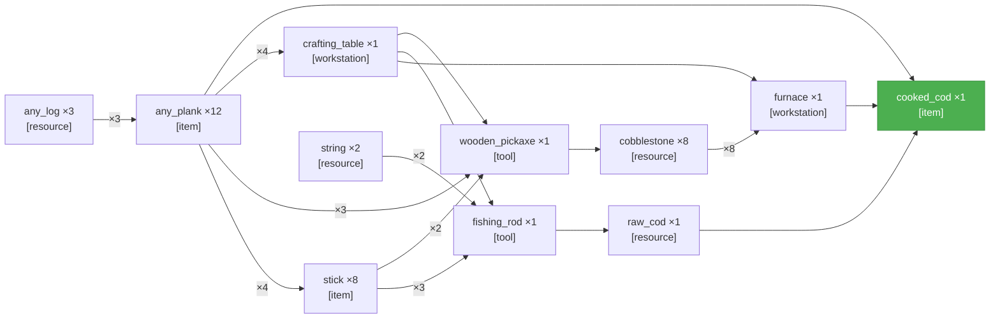

# PTD — catch and cook a fish
_Updated: 2026-04-11T02:45:29.854Z_

```mermaid
graph LR
    cooked_cod["cooked_cod ×1<br/>[item]"]
    raw_cod["raw_cod ×1<br/>[resource]"]
    furnace["furnace ×1<br/>[workstation]"]
    any_plank["any_plank ×12<br/>[item]"]
    any_log["any_log ×3<br/>[resource]"]
    crafting_table["crafting_table ×1<br/>[workstation]"]
    wooden_pickaxe["wooden_pickaxe ×1<br/>[tool]"]
    stick["stick ×8<br/>[item]"]
    string["string ×2<br/>[resource]"]
    cobblestone["cobblestone ×8<br/>[resource]"]
    fishing_rod["fishing_rod ×1<br/>[tool]"]
    raw_cod -->cooked_cod
    any_plank -->cooked_cod
    furnace -->cooked_cod
    fishing_rod -->raw_cod
    any_log -->|"×3"| any_plank
    any_plank -->|"×4"| crafting_table
    crafting_table -->wooden_pickaxe
    any_plank -->|"×3"| wooden_pickaxe
    stick -->|"×2"| wooden_pickaxe
    crafting_table -->fishing_rod
    stick -->|"×3"| fishing_rod
    string -->|"×2"| fishing_rod
    cobblestone -->|"×8"| furnace
    wooden_pickaxe -->cobblestone
    crafting_table -->furnace
    any_plank -->|"×4"| stick
    style cooked_cod fill:#4CAF50,color:#fff,stroke:#388E3C
```