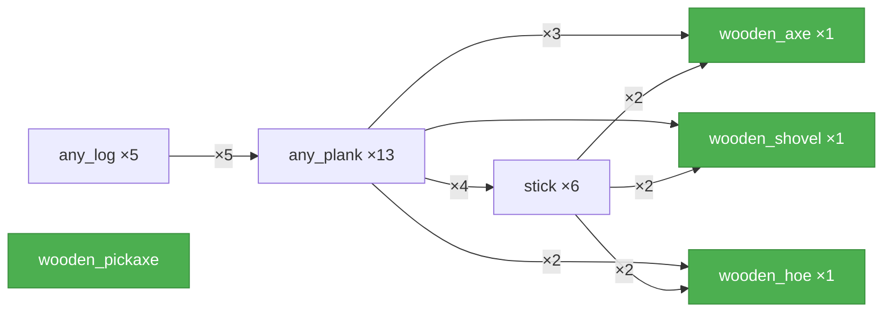

# SCSG — Craft one type of every tool
_Updated: 2026-04-11T03:39:35.530Z · r=0_

```mermaid
graph LR
    any_log["any_log ×5"]
    any_plank["any_plank ×13"]
    stick["stick ×6"]
    wooden_axe["wooden_axe ×1"]
    wooden_shovel["wooden_shovel ×1"]
    wooden_hoe["wooden_hoe ×1"]
    any_log -->|"×5"| any_plank
    any_plank -->|"×4"| stick
    any_plank -->|"×3"| wooden_axe
    stick -->|"×2"| wooden_axe
    any_plank -->wooden_shovel
    stick -->|"×2"| wooden_shovel
    any_plank -->|"×2"| wooden_hoe
    stick -->|"×2"| wooden_hoe
    style wooden_pickaxe fill:#4CAF50,color:#fff,stroke:#388E3C
    style wooden_axe fill:#4CAF50,color:#fff,stroke:#388E3C
    style wooden_shovel fill:#4CAF50,color:#fff,stroke:#388E3C
    style wooden_hoe fill:#4CAF50,color:#fff,stroke:#388E3C
```