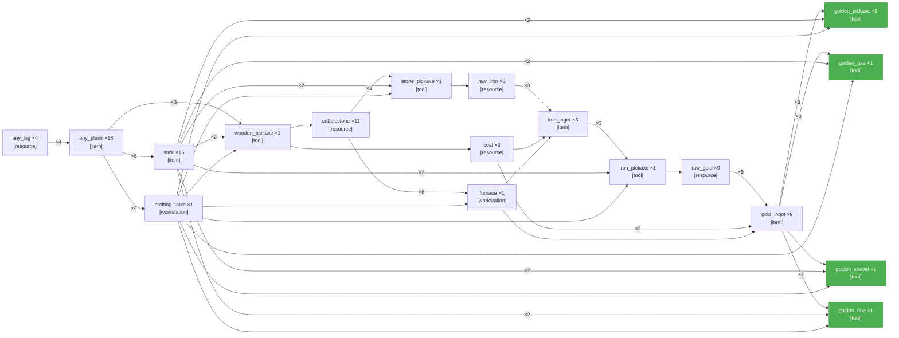

# PTD — Obtain one type of each type of golden tool\.

**LLM latency**
- **PTD generation:** 1m 21s

```mermaid
graph LR
    golden_pickaxe["golden_pickaxe ×1<br/>[tool]"]
    golden_axe["golden_axe ×1<br/>[tool]"]
    golden_shovel["golden_shovel ×1<br/>[tool]"]
    golden_hoe["golden_hoe ×1<br/>[tool]"]
    gold_ingot["gold_ingot ×9<br/>[item]"]
    raw_gold["raw_gold ×9<br/>[resource]"]
    iron_pickaxe["iron_pickaxe ×1<br/>[tool]"]
    iron_ingot["iron_ingot ×3<br/>[item]"]
    raw_iron["raw_iron ×3<br/>[resource]"]
    stone_pickaxe["stone_pickaxe ×1<br/>[tool]"]
    wooden_pickaxe["wooden_pickaxe ×1<br/>[tool]"]
    furnace["furnace ×1<br/>[workstation]"]
    crafting_table["crafting_table ×1<br/>[workstation]"]
    stick["stick ×16<br/>[item]"]
    any_plank["any_plank ×16<br/>[item]"]
    any_log["any_log ×4<br/>[resource]"]
    cobblestone["cobblestone ×11<br/>[resource]"]
    coal["coal ×3<br/>[resource]"]
    gold_ingot -->|"×3"| golden_pickaxe
    stick -->|"×2"| golden_pickaxe
    crafting_table -->golden_pickaxe
    gold_ingot -->|"×3"| golden_axe
    stick -->|"×2"| golden_axe
    crafting_table -->golden_axe
    gold_ingot -->golden_shovel
    stick -->|"×2"| golden_shovel
    crafting_table -->golden_shovel
    gold_ingot -->|"×2"| golden_hoe
    stick -->|"×2"| golden_hoe
    crafting_table -->golden_hoe
    raw_gold -->|"×9"| gold_ingot
    coal -->|"×2"| gold_ingot
    furnace -->gold_ingot
    iron_ingot -->|"×3"| iron_pickaxe
    stick -->|"×2"| iron_pickaxe
    crafting_table -->iron_pickaxe
    raw_iron -->|"×3"| iron_ingot
    coal -->iron_ingot
    furnace -->iron_ingot
    cobblestone -->|"×3"| stone_pickaxe
    stick -->|"×2"| stone_pickaxe
    crafting_table -->stone_pickaxe
    any_plank -->|"×3"| wooden_pickaxe
    stick -->|"×2"| wooden_pickaxe
    crafting_table -->wooden_pickaxe
    cobblestone -->|"×8"| furnace
    crafting_table -->furnace
    any_plank -->|"×4"| crafting_table
    any_log -->|"×4"| any_plank
    any_plank -->|"×8"| stick
    wooden_pickaxe -->cobblestone
    wooden_pickaxe -->coal
    stone_pickaxe -->raw_iron
    iron_pickaxe -->raw_gold
    style golden_pickaxe fill:#4CAF50,color:#fff,stroke:#388E3C
    style golden_axe fill:#4CAF50,color:#fff,stroke:#388E3C
    style golden_shovel fill:#4CAF50,color:#fff,stroke:#388E3C
    style golden_hoe fill:#4CAF50,color:#fff,stroke:#388E3C
```