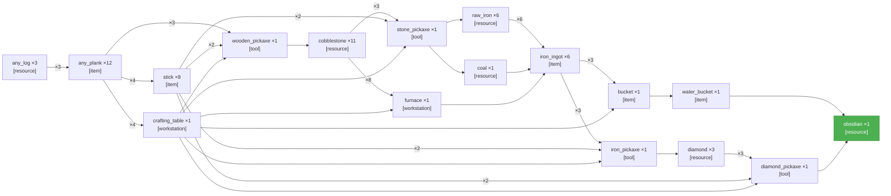

# PTD — Obtain one obsidian\.

**LLM latency**
- **PTD generation:** 1m 32s

```mermaid
graph LR
    obsidian["obsidian ×1<br/>[resource]"]
    water_bucket["water_bucket ×1<br/>[item]"]
    bucket["bucket ×1<br/>[item]"]
    iron_ingot["iron_ingot ×6<br/>[item]"]
    raw_iron["raw_iron ×6<br/>[resource]"]
    coal["coal ×1<br/>[resource]"]
    furnace["furnace ×1<br/>[workstation]"]
    iron_pickaxe["iron_pickaxe ×1<br/>[tool]"]
    diamond["diamond ×3<br/>[resource]"]
    diamond_pickaxe["diamond_pickaxe ×1<br/>[tool]"]
    stone_pickaxe["stone_pickaxe ×1<br/>[tool]"]
    cobblestone["cobblestone ×11<br/>[resource]"]
    wooden_pickaxe["wooden_pickaxe ×1<br/>[tool]"]
    crafting_table["crafting_table ×1<br/>[workstation]"]
    stick["stick ×8<br/>[item]"]
    any_plank["any_plank ×12<br/>[item]"]
    any_log["any_log ×3<br/>[resource]"]
    water_bucket -->obsidian
    diamond_pickaxe -->obsidian
    bucket -->water_bucket
    iron_ingot -->|"×3"| bucket
    crafting_table -->bucket
    raw_iron -->|"×6"| iron_ingot
    coal -->iron_ingot
    furnace -->iron_ingot
    iron_ingot -->|"×3"| iron_pickaxe
    stick -->|"×2"| iron_pickaxe
    crafting_table -->iron_pickaxe
    iron_pickaxe -->diamond
    diamond -->|"×3"| diamond_pickaxe
    stick -->|"×2"| diamond_pickaxe
    crafting_table -->diamond_pickaxe
    cobblestone -->|"×8"| furnace
    crafting_table -->furnace
    cobblestone -->|"×3"| stone_pickaxe
    stick -->|"×2"| stone_pickaxe
    crafting_table -->stone_pickaxe
    stone_pickaxe -->raw_iron
    stone_pickaxe -->coal
    wooden_pickaxe -->cobblestone
    any_plank -->|"×3"| wooden_pickaxe
    stick -->|"×2"| wooden_pickaxe
    crafting_table -->wooden_pickaxe
    any_plank -->|"×4"| crafting_table
    any_plank -->|"×4"| stick
    any_log -->|"×3"| any_plank
    style obsidian fill:#4CAF50,color:#fff,stroke:#388E3C
```