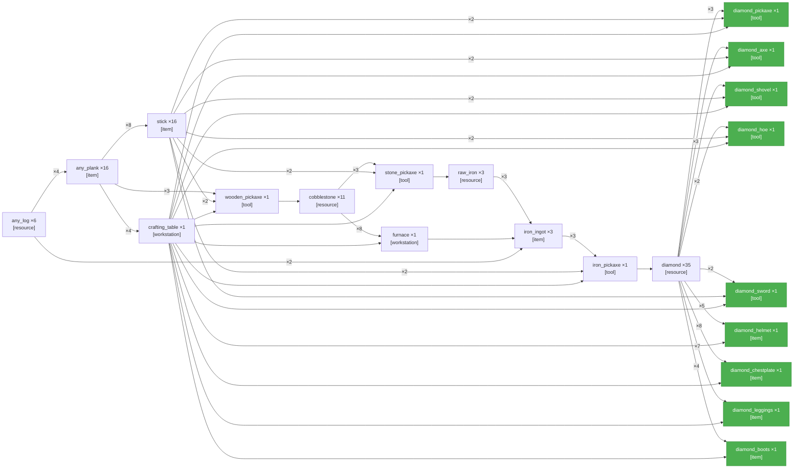

# PTD Self\-Refine — Get one type of each diamond tool, armor and weapon\.

## Round 0 · Generate

**Latency:** 2m 5.8s

---

## Round 0 · Validate

**Latency:** 54.8 s

**Verdict:** ✅ pass

**Summary:** Graph is well\-formed and executable: valid JSON; acyclic; sinks match the objective and have no outgoing edges; all edge endpoints exist; correct use of crafting, smelting, workstation, and tool dependencies; smelting includes input, fuel, and furnace; quantities are consistent \(inputs cover consumed outputs\) with only batch\-forced overproduction\. No material defects found\.

---
