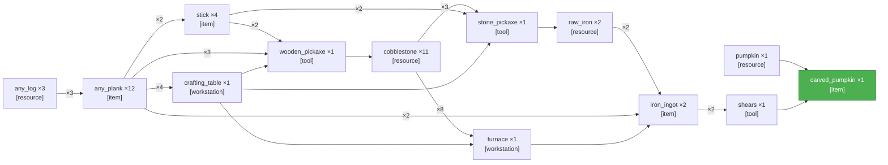

# PTD Self\-Refine — Obtain a carved pumpkin

## Round 0 · Generate

**Latency:** 1m 55s

---

## Round 0 · Validate

**Latency:** 1m 25s

**Verdict:** ✅ pass

**Possible issues:**
- \[object Object\]
- \[object Object\]

**Summary:** Graph is well\-formed, acyclic, has the correct sink \(carved\_pumpkin\), and includes complete and correctly typed prerequisites with consistent quantities\. No material defects found\.

---
