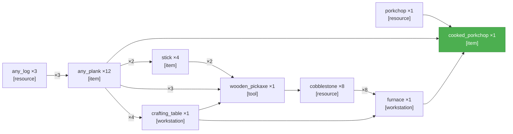
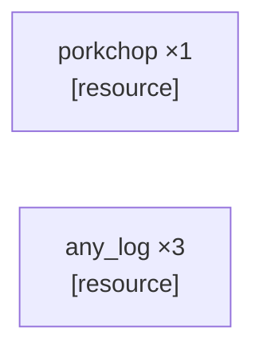

<table width="100%" style="table-layout: fixed; border-collapse: separate; border-spacing: 0;"><tr>
<td width="72%" valign="top" style="border: 1px solid #d0d7de; border-radius: 14px; padding: 18px 16px; box-sizing: border-box;">

_PTD not yet generated._

</td>
<td width="2%"></td>
<td width="26%" valign="top" style="border: 1px solid #d0d7de; border-radius: 14px; padding: 18px 16px; box-sizing: border-box;">

<div align="center" style="height: 100%; display: flex; flex-direction: column; justify-content: center;">
<div style="font-size: 0.85em; font-weight: 700; letter-spacing: 0.08em; text-transform: uppercase; opacity: 0.8; margin-bottom: 0.6em;">Elapsed</div>
<div style="font-size: 3.4em; font-weight: 800; line-height: 1; margin: 0 0 0.3em 0; white-space: nowrap;">0s</div>
<div style="font-size: 0.95em; font-weight: 600;">Running</div>
</div>

</td>
</tr></table>

---

<table width="100%" style="table-layout: fixed; border-collapse: separate; border-spacing: 0;"><tr>
<td width="50%" valign="top" style="border: 1px solid #d0d7de; border-radius: 14px; padding: 18px 16px; box-sizing: border-box;">

# SCSG — test
_r=1_



</td>
<td width="2%"></td>
<td width="50%" valign="top" style="border: 1px solid #d0d7de; border-radius: 14px; padding: 18px 16px; box-sizing: border-box;">

# Candidates — test
_2 source node\(s\)_



</td>
</tr></table>

---

<table width="100%" style="table-layout: fixed; border-collapse: separate; border-spacing: 0;"><tr>
<td width="50%" valign="top" style="border: 1px solid #d0d7de; border-radius: 14px; padding: 18px 16px; box-sizing: border-box;">

**Current Task**

```json
{
  "target_item": "any_log",
  "qty": 3,
  "action_type": "collect",
  "parameters": {
    "source_block": "spruce_log",
    "item_dependency": null,
    "tool": null
  }
}
```

</td>
<td width="2%"></td>
<td width="50%" valign="top" style="border: 1px solid #d0d7de; border-radius: 14px; padding: 18px 16px; box-sizing: border-box;">

**Current Action** _(attempt 1)_

```
!collectBlocks("spruce_log", 3)
```

</td>
</tr></table>