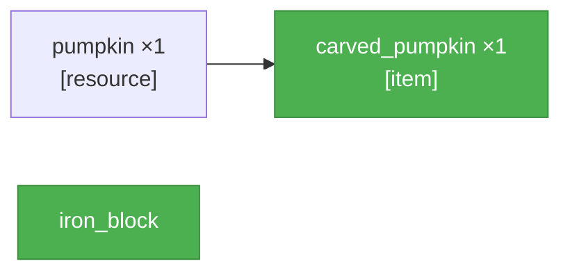

<table width="100%" style="table-layout: fixed; border-collapse: separate; border-spacing: 0;"><tr>
<td width="72%" valign="top" style="border: 1px solid #d0d7de; border-radius: 14px; padding: 18px 16px; box-sizing: border-box;">

_PTD not yet generated._

</td>
<td width="2%"></td>
<td width="26%" valign="top" style="border: 1px solid #d0d7de; border-radius: 14px; padding: 18px 16px; box-sizing: border-box;">

<div align="center" style="height: 100%; display: flex; flex-direction: column; justify-content: center;">
<div style="font-size: 0.85em; font-weight: 700; letter-spacing: 0.08em; text-transform: uppercase; opacity: 0.8; margin-bottom: 0.6em;">Elapsed</div>
<div style="font-size: 3.4em; font-weight: 800; line-height: 1; margin: 0 0 0.3em 0; white-space: nowrap;">4m 54s</div>
<div style="font-size: 0.95em; font-weight: 600;">Running</div>
</div>

</td>
</tr></table>

---

<table width="100%" style="table-layout: fixed; border-collapse: separate; border-spacing: 0;"><tr>
<td width="50%" valign="top" style="border: 1px solid #d0d7de; border-radius: 14px; padding: 18px 16px; box-sizing: border-box;">

# SCSG — test
_r=0_



</td>
<td width="2%"></td>
<td width="50%" valign="top" style="border: 1px solid #d0d7de; border-radius: 14px; padding: 18px 16px; box-sizing: border-box;">

**Recovery** _(attempt 3)_

**Diagnosis:** The bot was still underground in a beach biome, so the 500\-block search found no pumpkins\. Surface first, then travel inland to likely grassy biomes before searching and harvesting a pumpkin\.

**Plan:**
- `!moveAway(32)`
- `!goToSurface()`
- `!goToCoordinates(-32, 70, 700, 3)`
- `!searchForBlock("pumpkin", 500)`
- `!collectBlocks("pumpkin", 1)`

**Previous diagnoses:**
- _(attempt 2)_ The bot is still underground in a beach biome and the prior plan failed because goToSurface was blocked by andesite, then searching underground found no pumpkins\. Reposition to escape the blocked tunnel, reach the surface, then search a larger radius for pumpkins and harvest one\.
- _(attempt 1)_ The bot tried a generic search from an underground beach cave where pumpkins don’t generate, so nothing was found\. Go to the surface, then perform a proper block search and harvest the pumpkin\.


</td>
</tr></table>

---

<table width="100%" style="table-layout: fixed; border-collapse: separate; border-spacing: 0;"><tr>
<td width="50%" valign="top" style="border: 1px solid #d0d7de; border-radius: 14px; padding: 18px 16px; box-sizing: border-box;">

**Current Task**

```json
{
  "target_item": "pumpkin",
  "qty": 1,
  "action_type": "collect",
  "parameters": {
    "source_block": "pumpkin",
    "item_dependency": null,
    "tool": null
  }
}
```

</td>
<td width="2%"></td>
<td width="50%" valign="top" style="border: 1px solid #d0d7de; border-radius: 14px; padding: 18px 16px; box-sizing: border-box;">

**Recovery Actions** _(attempt 3)_

- ⏳ `!moveAway(32)`
- ⏳ `!goToSurface()`
- ⏳ `!goToCoordinates(-32, 70, 700, 3)`
- ⏳ `!searchForBlock("pumpkin", 500)`
- ⏳ `!collectBlocks("pumpkin", 1)`


</td>
</tr></table>