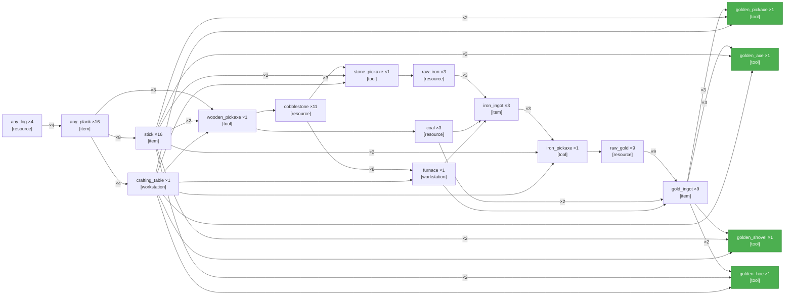

<table width="100%" style="table-layout: fixed; border-collapse: separate; border-spacing: 0;"><tr>
<td width="72%" valign="top" style="border: 1px solid #d0d7de; border-radius: 14px; padding: 18px 16px; box-sizing: border-box;">

# PTD — Obtain one type of each type of golden tool\.

**LLM latency**
- **PTD generation:** 1m 21s



</td>
<td width="2%"></td>
<td width="26%" valign="top" style="border: 1px solid #d0d7de; border-radius: 14px; padding: 18px 16px; box-sizing: border-box;">

<div align="center" style="height: 100%; display: flex; flex-direction: column; justify-content: center;">
<div style="font-size: 0.85em; font-weight: 700; letter-spacing: 0.08em; text-transform: uppercase; opacity: 0.8; margin-bottom: 0.6em;">Elapsed</div>
<div style="font-size: 3.4em; font-weight: 800; line-height: 1; margin: 0 0 0.3em 0; white-space: nowrap;">11m 32s</div>
<div style="font-size: 0.95em; font-weight: 600;">Completed</div>
</div>

</td>
</tr></table>

---

<table width="100%" style="table-layout: fixed; border-collapse: separate; border-spacing: 0;"><tr>
<td width="50%" valign="top" style="border: 1px solid #d0d7de; border-radius: 14px; padding: 18px 16px; box-sizing: border-box;">

# Completed — Obtain one type of each type of golden tool\.

**Task complete.**

- **Reason:** all sinks satisfied
- **Total elapsed:** 11m 32s


</td>
<td width="2%"></td>
<td width="50%" valign="top" style="border: 1px solid #d0d7de; border-radius: 14px; padding: 18px 16px; box-sizing: border-box;">

_Candidates not yet computed._

</td>
</tr></table>

---

<table width="100%" style="table-layout: fixed; border-collapse: separate; border-spacing: 0;"><tr>
<td width="50%" valign="top" style="border: 1px solid #d0d7de; border-radius: 14px; padding: 18px 16px; box-sizing: border-box;">

**Current Task**

```json
{
  "target_item": "golden_hoe",
  "qty": 1,
  "action_type": "craft",
  "parameters": {
    "crafting_inputs": [
      {
        "item": "gold_ingot",
        "qty": 2
      },
      {
        "item": "stick",
        "qty": 2
      }
    ],
    "workstation": "crafting_table"
  }
}
```

</td>
<td width="2%"></td>
<td width="50%" valign="top" style="border: 1px solid #d0d7de; border-radius: 14px; padding: 18px 16px; box-sizing: border-box;">

**Current Action** _(attempt 1)_

```
!craftRecipe("golden_hoe", 1)
```

**Previous:**

- _(attempt 1)_ `!craftRecipe("golden_shovel", 1)`
- _(attempt 1)_ `!craftRecipe("golden_axe", 1)`
- _(attempt 1)_ `!craftRecipe("golden_pickaxe", 1)`
- _(attempt 1)_ `!smelt_item("raw_gold", 9, "coal")`
- _(attempt 1)_ `!smelt_item("raw_gold", 9, "coal")`
- _(attempt 2)_ `!collectBlocks("gold_ore", 9)`
- _(attempt 3 · search)_ `!searchForBlock("gold_ore", 64)`
- _(attempt 2 · search)_ `!searchForBlock("gold_ore", 32)`
- _(attempt 1)_ `!search("gold_ore")`
- _(attempt 1)_ `!craftRecipe("iron_pickaxe", 1)`
- _(attempt 1)_ `!smelt_item("raw_iron", 3, "coal")`
- _(attempt 2)_ `!collectBlocks("iron_ore", 3)`
- _(attempt 2 · search)_ `!searchForBlock("iron_ore", 32)`
- _(attempt 1)_ `!search("iron_ore")`
- _(attempt 1)_ `!collectBlocks("coal_ore", 3)`
- _(attempt 1)_ `!craftRecipe("furnace", 1)`
- _(attempt 1)_ `!craftRecipe("stone_pickaxe", 1)`
- _(attempt 1)_ `!collectBlocks("stone", 11)`
- _(attempt 1)_ `!craftRecipe("wooden_pickaxe", 1)`
- _(attempt 1)_ `!craftRecipe("stick", 4)`
- _(attempt 1)_ `!craftRecipe("crafting_table", 1)`
- _(attempt 1)_ `!craftRecipe("oak_planks", 4)`
- _(attempt 1)_ `!collectBlocks("oak_log", 4)`

</td>
</tr></table>