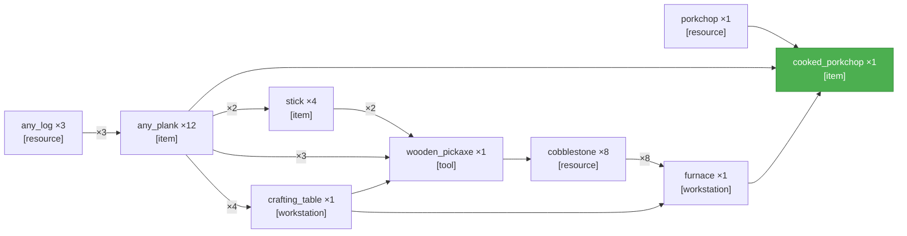

<table width="100%" style="table-layout: fixed; border-collapse: separate; border-spacing: 0;"><tr>
<td width="72%" valign="top" style="border: 1px solid #d0d7de; border-radius: 14px; padding: 18px 16px; box-sizing: border-box;">

# PTD — Cook a porkchop\.

**LLM latency**
- **PTD generation:** 55.5 s



</td>
<td width="2%"></td>
<td width="26%" valign="top" style="border: 1px solid #d0d7de; border-radius: 14px; padding: 18px 16px; box-sizing: border-box;">

<div align="center" style="height: 100%; display: flex; flex-direction: column; justify-content: center;">
<div style="font-size: 0.85em; font-weight: 700; letter-spacing: 0.08em; text-transform: uppercase; opacity: 0.8; margin-bottom: 0.6em;">Elapsed</div>
<div style="font-size: 3.4em; font-weight: 800; line-height: 1; margin: 0 0 0.3em 0; white-space: nowrap;">3m 18s</div>
<div style="font-size: 0.95em; font-weight: 600;">Completed</div>
</div>

</td>
</tr></table>

---

<table width="100%" style="table-layout: fixed; border-collapse: separate; border-spacing: 0;"><tr>
<td width="50%" valign="top" style="border: 1px solid #d0d7de; border-radius: 14px; padding: 18px 16px; box-sizing: border-box;">

# Completed — Cook a porkchop\.

**Task complete.**

- **Reason:** all sinks satisfied
- **Total elapsed:** 3m 18s


</td>
<td width="2%"></td>
<td width="50%" valign="top" style="border: 1px solid #d0d7de; border-radius: 14px; padding: 18px 16px; box-sizing: border-box;">

_Candidates not yet computed._

</td>
</tr></table>

---

<table width="100%" style="table-layout: fixed; border-collapse: separate; border-spacing: 0;"><tr>
<td width="50%" valign="top" style="border: 1px solid #d0d7de; border-radius: 14px; padding: 18px 16px; box-sizing: border-box;">

**Current Task**

**LLM latency**
- **Current output:** 1.18 s
- **Average output:** 1.04 s across 9 outputs

```json
{
  "target_item": "cooked_porkchop",
  "qty": 1,
  "action_type": "smelt",
  "parameters": {
    "smelting_inputs": [
      {
        "item": "porkchop",
        "qty": 1
      }
    ],
    "fuel_inputs": [
      {
        "item": "any_plank",
        "qty": 1
      }
    ],
    "workstation": "furnace"
  }
}
```

</td>
<td width="2%"></td>
<td width="50%" valign="top" style="border: 1px solid #d0d7de; border-radius: 14px; padding: 18px 16px; box-sizing: border-box;">

**Current Action** _(attempt 1)_

**LLM latency**
- **Current output:** 745 ms
- **Average output:** 721 ms across 12 outputs

```
!smeltItem("porkchop", 1)
```

**Previous:**

- _(attempt 2)_ `!attack("pig")`
- _(attempt 3 · search)_ `!searchForEntity("pig", 64)`
- _(attempt 2 · search)_ `!searchForEntity("pig", 32)`
- _(attempt 1)_ `!search("pig")`
- _(attempt 1)_ `!craftRecipe("furnace", 1)`
- _(attempt 1)_ `!collectBlocks("stone", 8)`
- _(attempt 1)_ `!craftRecipe("wooden_pickaxe", 1)`
- _(attempt 1)_ `!craftRecipe("stick", 1)`
- _(attempt 1)_ `!craftRecipe("crafting_table", 1)`
- _(attempt 2)_ `TASK_COMPLETE`
- _(attempt 1)_ `!craftRecipe("spruce_planks", 3)`
- _(attempt 2)_ `!collectBlocks("spruce_log", 3)`
- _(attempt 3 · search)_ `!searchForBlock("spruce_log", 32)`
- _(attempt 2 · search)_ `!searchForBlock("oak_log", 32)`
- _(attempt 1)_ `!search("any_log")`

</td>
</tr></table>