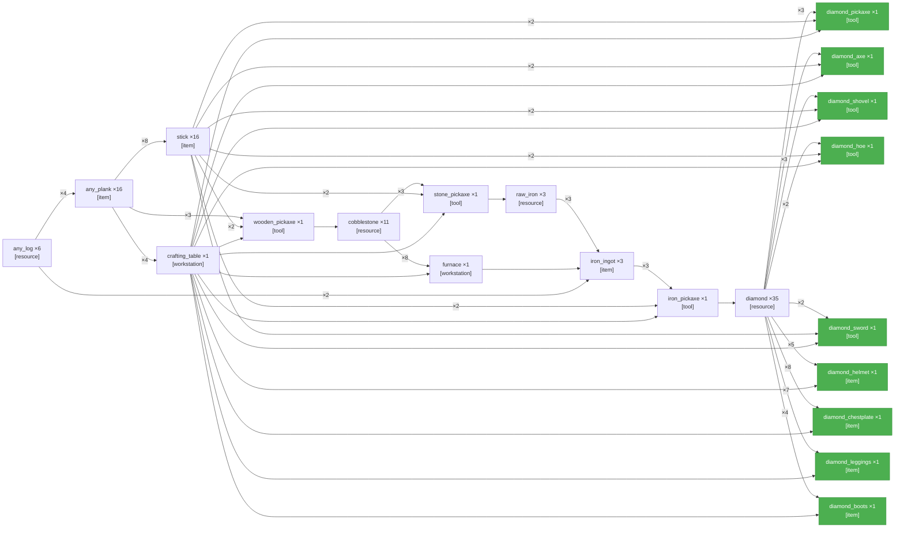

<table width="100%" style="table-layout: fixed; border-collapse: separate; border-spacing: 0;"><tr>
<td width="72%" valign="top" style="border: 1px solid #d0d7de; border-radius: 14px; padding: 18px 16px; box-sizing: border-box;">

# PTD — Get one type of each diamond tool, armor and weapon\.

**LLM latency**
- **PTD generation:** 2m 5.8s



</td>
<td width="2%"></td>
<td width="26%" valign="top" style="border: 1px solid #d0d7de; border-radius: 14px; padding: 18px 16px; box-sizing: border-box;">

<div align="center" style="height: 100%; display: flex; flex-direction: column; justify-content: center;">
<div style="font-size: 0.85em; font-weight: 700; letter-spacing: 0.08em; text-transform: uppercase; opacity: 0.8; margin-bottom: 0.6em;">Elapsed</div>
<div style="font-size: 3.4em; font-weight: 800; line-height: 1; margin: 0 0 0.3em 0; white-space: nowrap;">3m 00s</div>
<div style="font-size: 0.95em; font-weight: 600;">Completed</div>
</div>

</td>
</tr></table>

---

<table width="100%" style="table-layout: fixed; border-collapse: separate; border-spacing: 0;"><tr>
<td width="50%" valign="top" style="border: 1px solid #d0d7de; border-radius: 14px; padding: 18px 16px; box-sizing: border-box;">

# Completed — Get one type of each diamond tool, armor and weapon\.

**Task complete.**

- **Reason:** PTD accepted after validation round 0
- **Total elapsed:** 3m 00s


</td>
<td width="2%"></td>
<td width="50%" valign="top" style="border: 1px solid #d0d7de; border-radius: 14px; padding: 18px 16px; box-sizing: border-box;">

_Candidates not yet computed._

</td>
</tr></table>

---

<table width="100%" style="table-layout: fixed; border-collapse: separate; border-spacing: 0;"><tr>
<td width="50%" valign="top" style="border: 1px solid #d0d7de; border-radius: 14px; padding: 18px 16px; box-sizing: border-box;">

**Current Task**

```json
{
  "target_item": "iron_ingot",
  "qty": 3,
  "action_type": "smelt",
  "parameters": {
    "smelting_inputs": [
      {
        "item": "raw_iron",
        "qty": 3
      }
    ],
    "fuel_inputs": [
      {
        "item": "any_log",
        "qty": 2
      }
    ],
    "workstation": "furnace"
  }
}
```

</td>
<td width="2%"></td>
<td width="50%" valign="top" style="border: 1px solid #d0d7de; border-radius: 14px; padding: 18px 16px; box-sizing: border-box;">

**Current Action** _(attempt 1)_

```
!smelt_item("raw_iron", 3, "spruce_log")
```

**Previous:**

- _(attempt 1)_ `!smelt_item("raw_iron", 3, "spruce_log")`
- _(attempt 1)_ `!collectBlocks("iron_ore", 2)`
- _(attempt 1)_ `!craftRecipe("stone_pickaxe", 1)`
- _(attempt 2)_ `!collectBlocks("iron_ore", 2)`
- _(attempt 2 · search)_ `!searchForBlock("iron_ore", 32)`
- _(attempt 1)_ `!search("iron_ore")`
- _(attempt 1)_ `!craftRecipe("furnace", 1)`
- _(attempt 1)_ `!collectBlocks("stone", 8)`
- _(attempt 1)_ `!craftRecipe("stick", 1)`
- _(attempt 5)_ `!collectBlocks("diamond_ore", 35)`
- _(attempt 5 · search)_ `!searchForBlock("diamond_ore", 32)`
- _(attempt 4)_ `!search("diamond_ore")`
- _(attempt 4 · search)_ `!searchForBlock("diamond_ore", 32)`
- _(attempt 3)_ `!search("diamond_ore")`
- _(attempt 3 · search)_ `!searchForBlock("diamond_ore", 32)`
- _(attempt 2)_ `!search("diamond_ore")`
- _(attempt 3 · search)_ `!searchForBlock("diamond_ore", 64)`
- _(attempt 2 · search)_ `!searchForBlock("diamond_ore", 32)`
- _(attempt 1)_ `!search("diamond_ore")`
- _(attempt 1)_ `!craftRecipe("stick", 2)`
- _(attempt 1)_ `!craftRecipe("spruce_planks", 1)`
- _(attempt 1)_ `!craftRecipe("oak_planks", 2)`
- _(attempt 1)_ `!collectBlocks("spruce_log", 2)`

</td>
</tr></table>