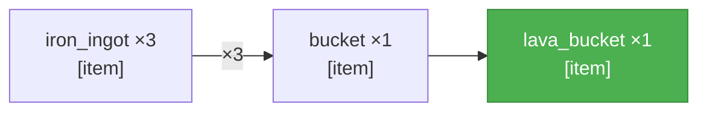

# SCSG — test
_r=0_

```mermaid
graph LR
    lava_bucket["lava_bucket ×1<br/>[item]"]
    bucket["bucket ×1<br/>[item]"]
    iron_ingot["iron_ingot ×3<br/>[item]"]
    bucket -->lava_bucket
    iron_ingot -->|"×3"| bucket
    style lava_bucket fill:#4CAF50,color:#fff,stroke:#388E3C
```