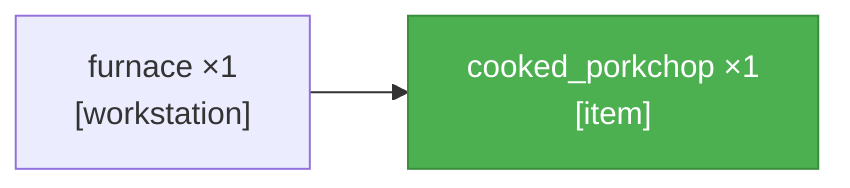

# SCSG — tes 
_r=0_

```mermaid
graph LR
    cooked_porkchop["cooked_porkchop ×1<br/>[item]"]
    furnace["furnace ×1<br/>[workstation]"]
    furnace -->cooked_porkchop
    style cooked_porkchop fill:#4CAF50,color:#fff,stroke:#388E3C
```