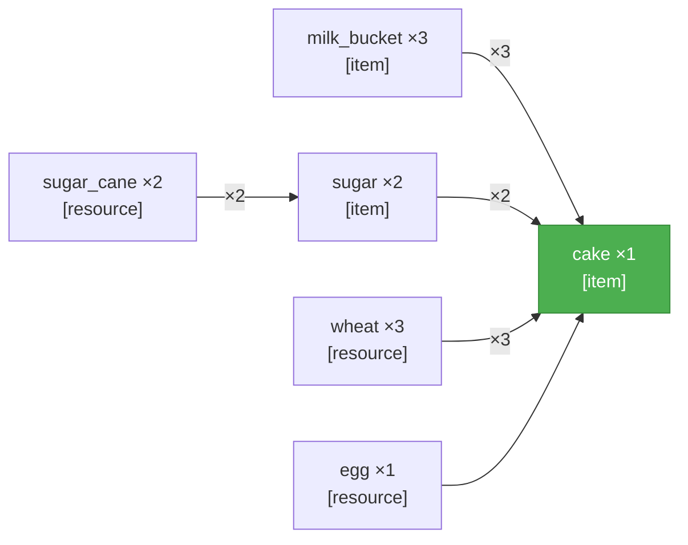

# SCSG — tset
_r=0_

```mermaid
graph LR
    cake["cake ×1<br/>[item]"]
    milk_bucket["milk_bucket ×3<br/>[item]"]
    sugar["sugar ×2<br/>[item]"]
    wheat["wheat ×3<br/>[resource]"]
    egg["egg ×1<br/>[resource]"]
    sugar_cane["sugar_cane ×2<br/>[resource]"]
    milk_bucket -->|"×3"| cake
    sugar -->|"×2"| cake
    wheat -->|"×3"| cake
    egg -->cake
    sugar_cane -->|"×2"| sugar
    style cake fill:#4CAF50,color:#fff,stroke:#388E3C
```