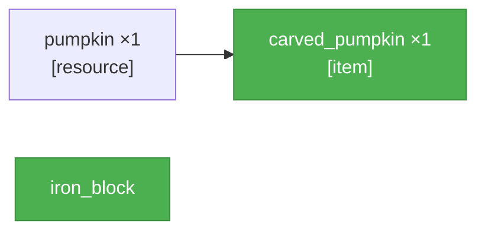

# SCSG — test
_r=0_

```mermaid
graph LR
    carved_pumpkin["carved_pumpkin ×1<br/>[item]"]
    pumpkin["pumpkin ×1<br/>[resource]"]
    pumpkin -->carved_pumpkin
    style iron_block fill:#4CAF50,color:#fff,stroke:#388E3C
    style carved_pumpkin fill:#4CAF50,color:#fff,stroke:#388E3C
```