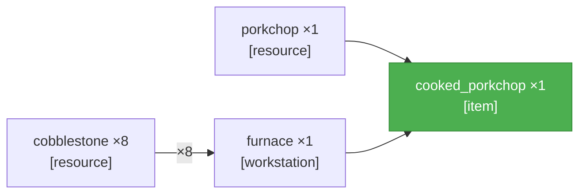

# SCSG — TEST
_r=0_

```mermaid
graph LR
    cooked_porkchop["cooked_porkchop ×1<br/>[item]"]
    porkchop["porkchop ×1<br/>[resource]"]
    furnace["furnace ×1<br/>[workstation]"]
    cobblestone["cobblestone ×8<br/>[resource]"]
    porkchop -->cooked_porkchop
    furnace -->cooked_porkchop
    cobblestone -->|"×8"| furnace
    style cooked_porkchop fill:#4CAF50,color:#fff,stroke:#388E3C
```