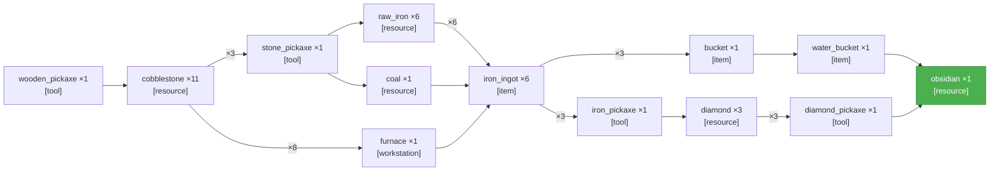

# SCSG — Obtain one obsidian\. 
_r=0_

```mermaid
graph LR
    obsidian["obsidian ×1<br/>[resource]"]
    water_bucket["water_bucket ×1<br/>[item]"]
    bucket["bucket ×1<br/>[item]"]
    iron_ingot["iron_ingot ×6<br/>[item]"]
    raw_iron["raw_iron ×6<br/>[resource]"]
    coal["coal ×1<br/>[resource]"]
    furnace["furnace ×1<br/>[workstation]"]
    iron_pickaxe["iron_pickaxe ×1<br/>[tool]"]
    diamond["diamond ×3<br/>[resource]"]
    diamond_pickaxe["diamond_pickaxe ×1<br/>[tool]"]
    stone_pickaxe["stone_pickaxe ×1<br/>[tool]"]
    cobblestone["cobblestone ×11<br/>[resource]"]
    wooden_pickaxe["wooden_pickaxe ×1<br/>[tool]"]
    water_bucket -->obsidian
    diamond_pickaxe -->obsidian
    bucket -->water_bucket
    iron_ingot -->|"×3"| bucket
    raw_iron -->|"×6"| iron_ingot
    coal -->iron_ingot
    furnace -->iron_ingot
    iron_ingot -->|"×3"| iron_pickaxe
    iron_pickaxe -->diamond
    diamond -->|"×3"| diamond_pickaxe
    cobblestone -->|"×8"| furnace
    cobblestone -->|"×3"| stone_pickaxe
    stone_pickaxe -->raw_iron
    stone_pickaxe -->coal
    wooden_pickaxe -->cobblestone
    style obsidian fill:#4CAF50,color:#fff,stroke:#388E3C
```